<div align="center">

# Pokémon Yellow 3D

**Explore Kanto from a new perspective.**

A 3D presentation layer for statically recompiled Pokémon Yellow, with an overhead camera, first-person exploration, and the original game logic.

[](https://github.com/dobbygl/pokeyellow3d/actions/workflows/ci.yml)
[](https://github.com/dobbygl/pokeyellow3d/actions/workflows/release.yml)

[Get started](#get-started) · [Screenshots](#screenshots) · [Controls](#controls) · [Development status](#development-status) · [Documentation](#documentation) · [Contributing](#contributing)


**38 outdoor maps · 179 reachable interiors · Two camera modes**

</div>

`pokeyellow3d` is a fork of [GB-Recomp/pokeyellow](https://github.com/GB-Recomp/pokeyellow), powered by [gb-recompiled](https://github.com/GB-Recomp/gb-recompiled). It builds Pokémon Yellow into a native executable and adds a 3D view of the world. Movement, collisions, encounters, story events, battles, and saving remain under the original game's control.

> [!NOTE]
> This is a playable prototype under active development. Outdoor exploration, interiors, and battle presentation have automated coverage, including the completed B1/B2 battle milestones. Validation covers representative scenarios, not a complete story playthrough. See [development status](#development-status) for the current scope.

## Highlights

- **A connected Kanto.** Explore 36 connected outdoor maps, plus Viridian Forest and Vermilion Dock, with terrain, buildings, and textures derived from the ROM.
- **An animated world.** Water and flowers follow the live Game Boy animation phase. Distant NPCs use their original ROM walking frames; grass sways and movement leaves small grass or surf trails. Effects pause with the game and reset on loads and map changes.
- **Pallet Town at the title screen.** The original copyright, Game Freak logo and Pikachu intro lead through a fade into an actor-free sunset scene, with the original logo and a VRAM-decoded Pikachu billboard. Continue, New Game and naming retain the original menus over the dimmed scene.
- **Two perspectives.** Switch between an adjustable overhead camera and first person. Original tile-based movement and four-way interaction are preserved.
- **Interiors on demand.** Enter houses, shops, Pokémon Centers, laboratories, and caves. The renderer generates all 179 reachable interiors as needed.
- **Battles in 3D.** Normal battles combine original Pokémon portraits with animated health displays, trainer introductions, four effect categories, and Poké Ball throws and shakes. Complex moves preserve the original animation; menus and text remain faithful to the game.
- **An integrated HUD with the ROM font.** Recognized menus, battle controls and compatible labels share dark panels and original glyphs. The game still supplies all menu text and selections. Integrated is the default; Esc can persistently restore the classic presentation. Special graphics and unsupported regions retain their original LCD pixels.
- **Original interfaces over a 3D world.** Dialogues and recognized windows retain the scene behind them; unrecognized full-screen menus frame the original LCD over a dimmed, blurred background. `F2` crossfades into original 2D presentation. Fly, Teleport and Dig follow the engine's white fade and relocate the camera at the destination; bike and surf remain continuous.
- **Pokédex and storage.** Browse the original list and data on a 3D device, see encounter areas over Kanto, and use Bill’s twelve boxes. Bill, player and Oak PC menus use themed panels with the original text, cursor, scrolling and quantities over their shelf or monitor. The Hall of Fame retains its original information windows and portraits.
- **Bounded rendering work.** Exploration meshes are cached for the current map and its immediate neighbors, with at most five resident maps.

## Screenshots

Real captures from the renderer and its QA runs, stored at their original 800 × 720 resolution. Click any image to inspect it. Pallet Town, first person, battle and the interface captures below show the integrated style. The other landmark views retain their classic-style captures; Celadon City and Viridian Forest use the map-catalog preview camera.

| First-person exploration | Viridian City |
| --- | --- |
| [](docs/screenshots/first-person.png) | [](docs/screenshots/viridian-city.png) |
| **Celadon City** | **Viridian Forest** |
| [](docs/screenshots/celadon-city.png) | [](docs/screenshots/viridian-forest.png) |
| **Professor Oak's laboratory** | **Battle presentation** |
| [](docs/screenshots/oaks-lab.png) | [](docs/screenshots/battle.png) |

| Integrated Start menu | PC storage |
| --- | --- |
| [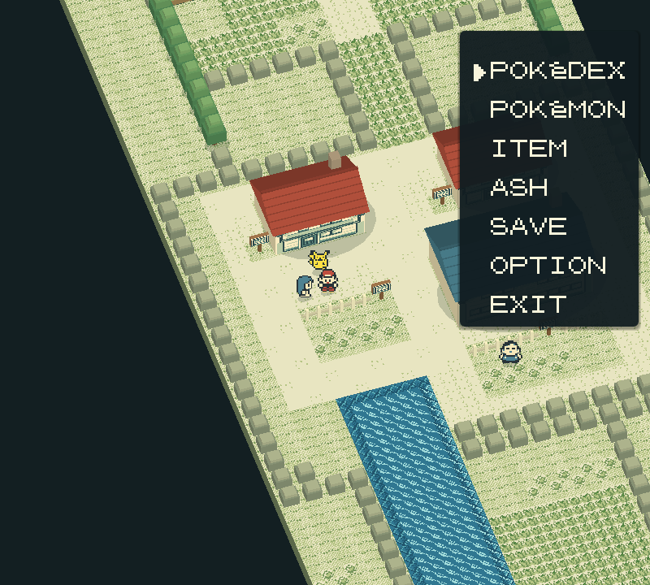](docs/screenshots/integrated-start.png) | [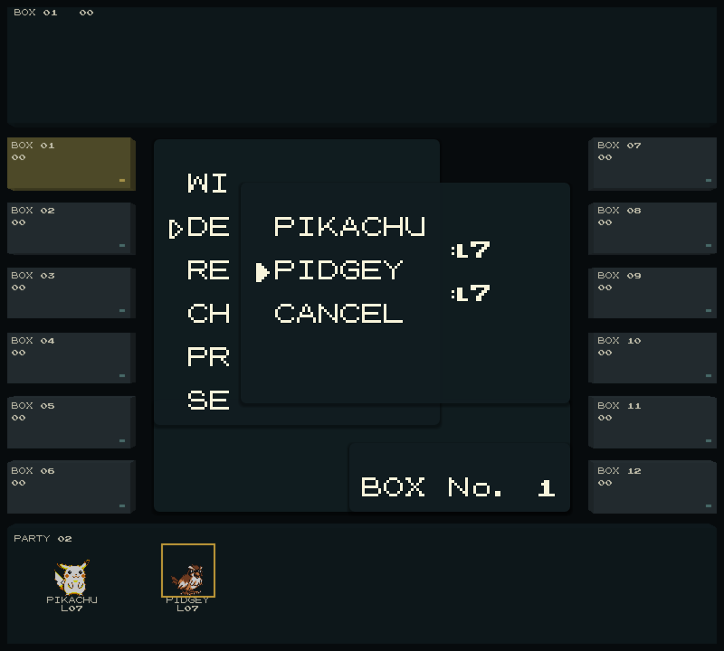](docs/screenshots/integrated-pc.png) |
| Player PC in first person | Oak PC |
| --- | --- |
| [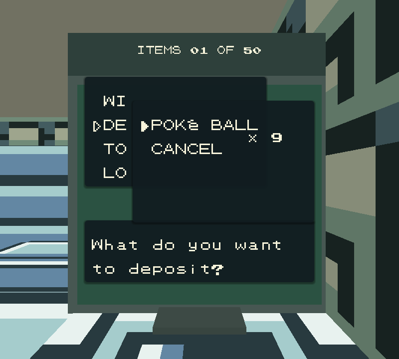](docs/screenshots/integrated-player-pc.png) | [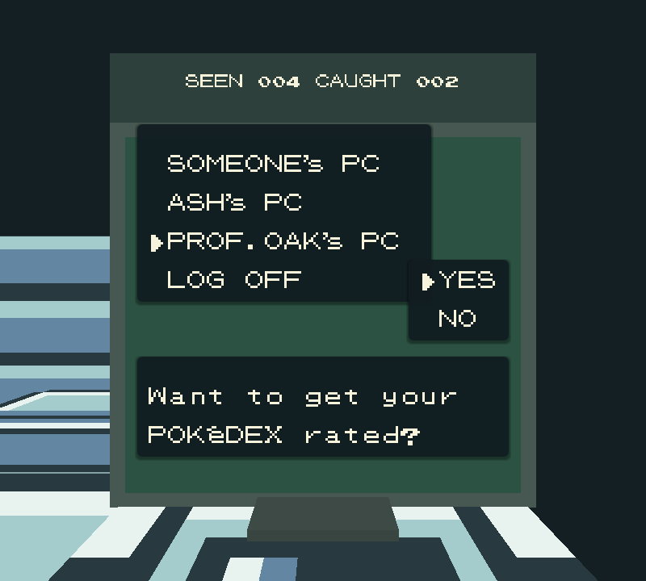](docs/screenshots/integrated-oak-pc.png) |
| **Pokédex** | **Hall of Fame** |
| [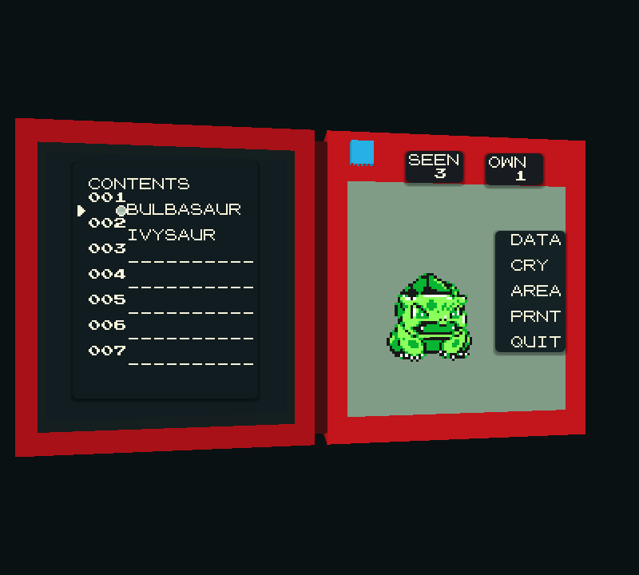](docs/screenshots/integrated-pokedex-list.png) | [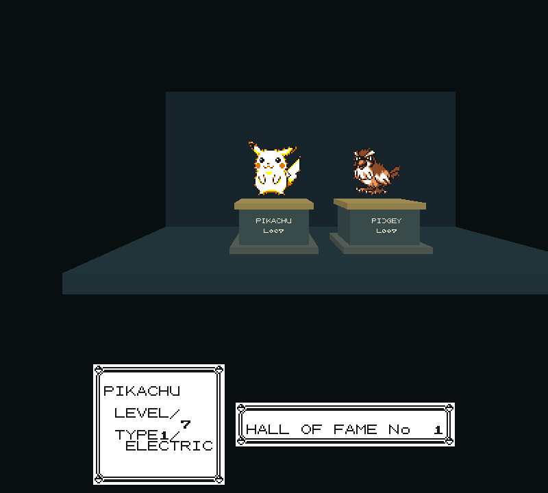](docs/screenshots/integrated-hall.png) |

| Bag | Mart | Battle inventory |
| --- | --- | --- |
| [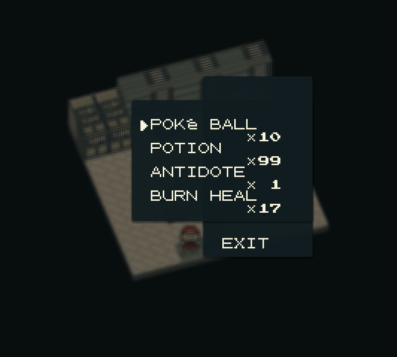](docs/screenshots/integrated-bag.png) | [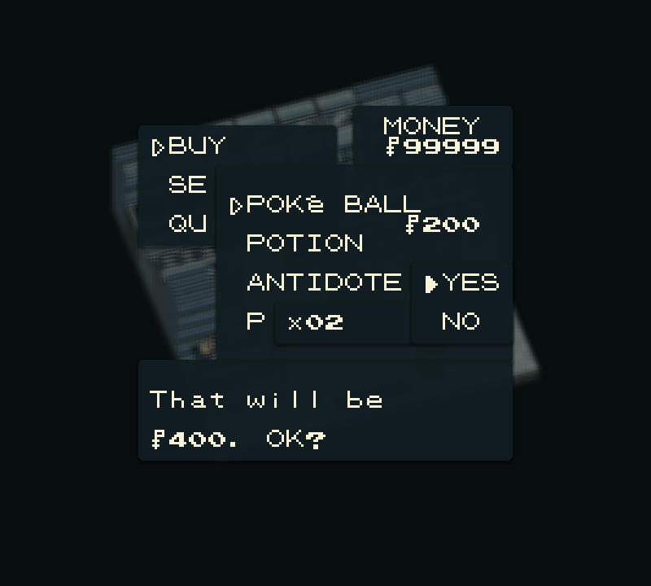](docs/screenshots/integrated-mart.png) | [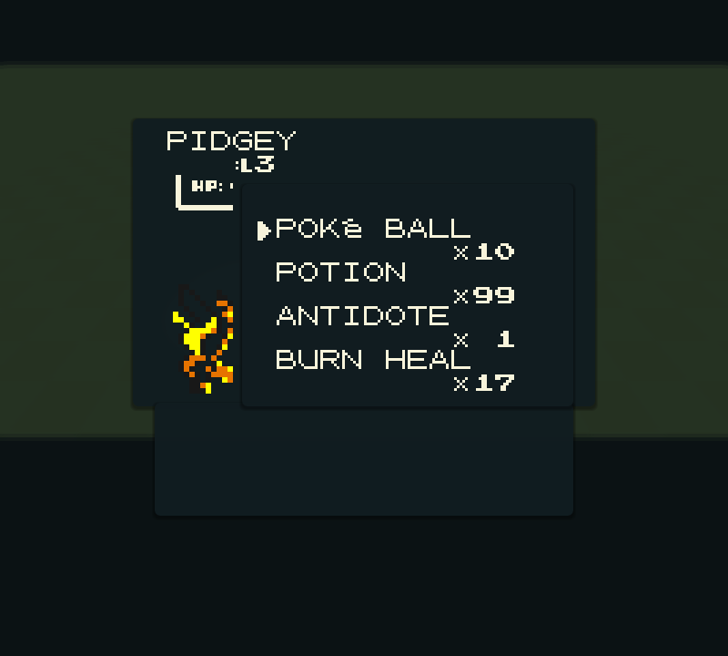](docs/screenshots/integrated-battle-bag.png) |

| Party | Pokémon summary | Moves and experience |
| --- | --- | --- |
| [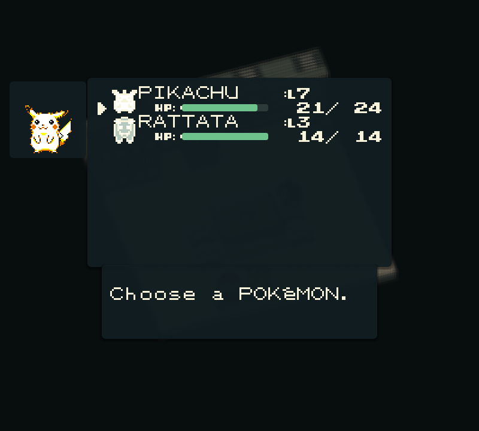](docs/screenshots/integrated-party.png) | [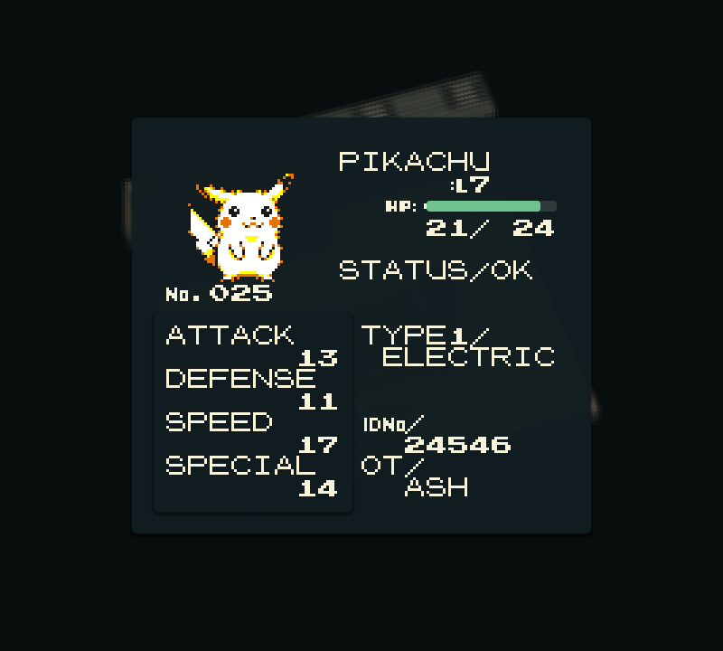](docs/screenshots/integrated-summary.png) | [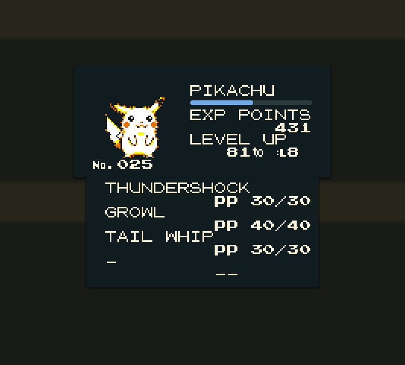](docs/screenshots/integrated-moves.png) |

Options, the trainer card and naming keyboard preserve the original text, graphics and controls:

| Options | Trainer card |
| --- | --- |
| [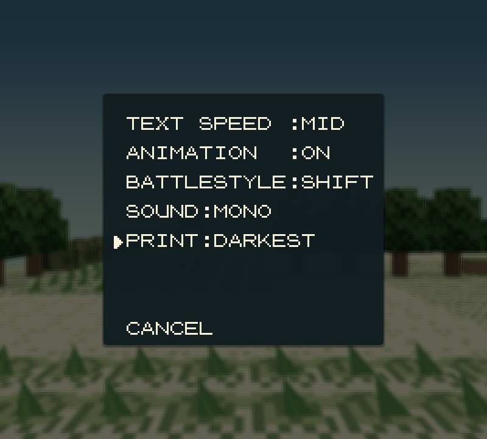](docs/screenshots/integrated-options.png) | [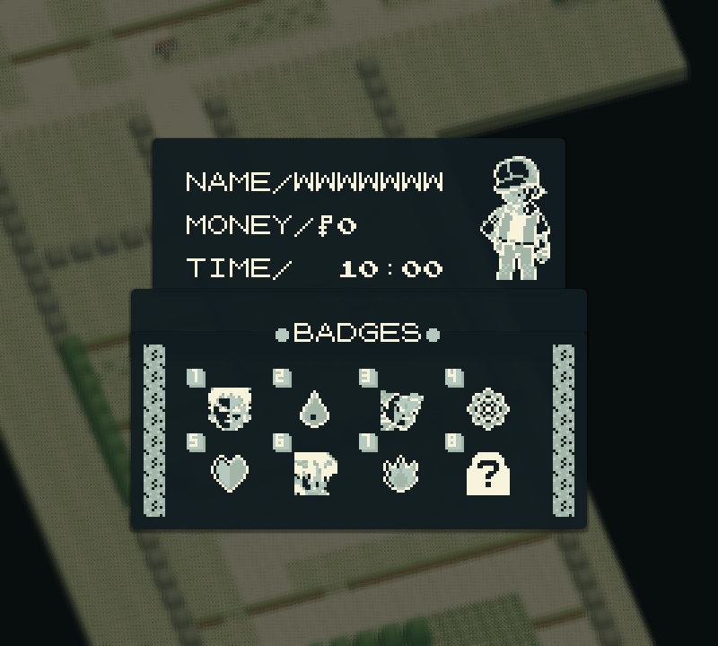](docs/screenshots/integrated-trainer-card.png) |

[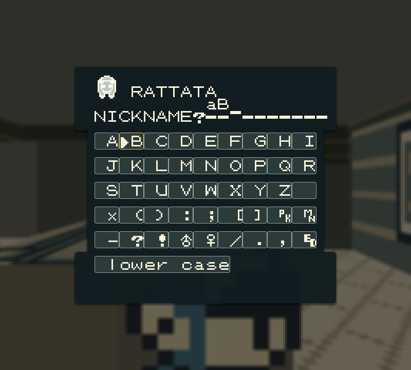](docs/screenshots/integrated-naming.png)

## Get started

### Prebuilt packages

Download [v0.4.0 for Linux or Windows x86_64](https://github.com/dobbygl/pokeyellow3d/releases/tag/v0.4.0), extract the complete ZIP, and follow its `RUN.md`. Supply your matching ROM as `roms/pokeyellow.gbc` beside the executable. Packages contain no ROM, game assets or save.

- **Linux:** built on Ubuntu 24.04; uses system SDL2, libcurl and OpenGL/GLES libraries listed in `DEPENDENCIES.txt`. Open a terminal in the package directory and run `./pokeyellow3d`.
- **Windows 10/11 x64:** includes SDL2, CURL, ANGLE and MSVC runtime DLLs. Double-click `Start.cmd`, which selects the package directory before launching. Keep the DLLs beside the executable; no compiler or vcpkg installation is required.

Version v0.4.0 includes the integrated PC, party, summary, bag, mart, Pokédex list, options, trainer card and naming screens shown above. Classic presentation remains available in Esc.

Each ZIP has a companion `.sha256` checksum. The launcher is included in `pokeyellow3d`; it starts the game once the matching user-supplied ROM is available.

### Requirements

ROM-backed journeys and capture comparisons run on Linux with Mesa. Native
Windows/MSVC builds and all twenty-four ROM-independent tests, including the
Windows/ANGLE renderer, pass in CI. macOS has not been validated.

- Git and CMake **3.18 or newer**.
- A compiler with **C11 and C++17** support, plus Make or Ninja.
- **SDL2**, **libcurl**, and **OpenGL ES 2** development libraries and a compatible graphics driver.
- A matching **English USA/Europe Pokémon Yellow ROM**, supplied by you.

CMake downloads the pinned `gb-recompiled` runtime automatically, so the first configure requires network access. Generated C sources are included; RGBDS and the Pokémon disassembly are only needed if you regenerate them.

> [!IMPORTANT]
> No ROM or extracted game assets are included. This build targets the 1 MiB English USA/Europe ROM with SHA-1 `cc7d03262ebfaf2f06772c1a480c7d9d5f4a38e1`. Other revisions and ROM hacks are not supported.

### Build and launch

```sh
git clone https://github.com/dobbygl/pokeyellow3d.git
cd pokeyellow3d

# Supply your matching ROM before configuring to enable all ROM-based tests.
mkdir -p build/roms
cp /path/to/pokeyellow.gb build/roms/pokeyellow.gbc

cmake -S . -B build -DPOKEYELLOW_3D=ON
cmake --build build --parallel 4
ctest --test-dir build --output-on-failure

cd build
./pokeyellow3d
```

On first launch, the runtime extracts the required assets into `assets/pokeyellow/` inside the build directory. Later launches reuse those assets. The launcher starts Pokémon Yellow automatically when its ROM or extracted assets are available.

Run the executable from `build/` so its relative paths resolve correctly. Battery saves are written to `build/pokeyellow.sav`; `Esc` opens runtime settings, including save states and **Restart Game**. Close other instances before using the same save.

### Building on Windows

Use an x64 Developer PowerShell for Visual Studio 2022 with the C++ tools,
Git, CMake and Ninja. The Windows CI configuration uses the pinned vcpkg
manifest in `.github/windows` to build SDL2, CURL and ANGLE (GLES2/EGL).
From the repository root:

```powershell
git clone https://github.com/microsoft/vcpkg build/qa/vcpkg
git -C build/qa/vcpkg checkout 5f96cd15fd745122cf27e0524606d6c1efc5fd07
./build/qa/vcpkg/bootstrap-vcpkg.bat -disableMetrics
cmake -S . -B build/windows -G Ninja `
  "-DCMAKE_TOOLCHAIN_FILE=$PWD/build/qa/vcpkg/scripts/buildsystems/vcpkg.cmake" `
  "-DVCPKG_MANIFEST_DIR=$PWD/.github/windows" `
  -DVCPKG_TARGET_TRIPLET=x64-windows -DPOKEYELLOW_3D=ON -DCMAKE_BUILD_TYPE=MinSizeRel
cmake --build build/windows --parallel 4
$env:PATH = "$PWD/build/windows/vcpkg_installed/x64-windows/bin;$env:PATH"
ctest --test-dir build/windows -LE rom --output-on-failure
New-Item -ItemType Directory -Force build/windows/roms
Copy-Item C:/path/to/pokeyellow.gb build/windows/roms/pokeyellow.gbc
Set-Location build/windows
./pokeyellow3d.exe
```

The first dependency build takes longer; subsequent builds reuse it. Saves,
extracted assets and runtime settings live in the chosen build directory.
For a prebuilt Windows package with its runtime DLLs, use the v0.2.0 download above.

<details>
<summary><strong>Build the original 2D executable</strong></summary>

From the repository root:

```sh
cmake -S . -B build/2d -DPOKEYELLOW_3D=OFF
cmake --build build/2d --parallel 4
mkdir -p build/2d/roms
cp /path/to/pokeyellow.gb build/2d/roms/pokeyellow.gbc
cd build/2d
./pokeyellow
```

This produces the original `pokeyellow` executable in a separate build directory, with its own assets and saves.

</details>

## Controls

| Input | Action |
| --- | --- |
| `F2` | Switch between original 2D and 3D presentation |
| `F3` | Switch between overhead and first-person cameras |
| Arrow keys | Original movement along the map axes |
| `W` / `A` / `S` / `D`, overhead | Original up / left / down / right movement |
| `W`, first person | Move forward |
| `A` / `D`, first person | Turn left / right by 90° |
| `S`, first person | Turn around |
| `Q` / `E`, overhead | Rotate the camera within its allowed arc |
| Mouse wheel / `R`, overhead | Zoom / reset camera |
| `Z` or `J` | A: talk, interact, confirm |
| `X` or `K` | B: cancel, go back |
| `Enter` | Original game menu |
| `Esc` | Application settings |

First person follows the original movement grid; it does not provide free movement or mouse look. Dialogues and menus retain the original game controls. Small interiors use a fixed overhead framing; larger rooms allow limited rotation and zoom.

In `Esc` settings, **Hora del mundo** selects disabled lighting, your local clock, or a fixed time. Daylight changes the sun direction, sky, fog and window light in both cameras. It starts disabled and stores its preference separately from cartridge saves; encounters and game time remain under the original engine's control. The title keeps its fixed sunset.

In `Esc`, **Estilo de menus** selects **Integrado** or **Clasico**. The choice is saved with the lighting preferences, separately from cartridge saves. Integrated retains the ROM typeface; Esc settings use the application font.

Integrated panel backgrounds fade and move over about 150 ms using the Game Boy cycle clock. Text keeps its full ink and fixed position from the first frame. Esc and focus loss freeze the animation, shared windows keep their phase, and loading an open menu shows it immediately.

## Development status

| Area | Current scope |
| --- | --- |
| Outdoor world | 36 connected maps, Viridian Forest, and Vermilion Dock; geometry audits and representative journeys are implemented. |
| First person | Movement, turning, transitions, dialogue overlays, and camera parity have dedicated checks. |
| Day/night lighting | Local or fixed time, directional light, sky, fog and illuminated original windows; separately persisted settings and disabled rendering parity. Verified in 24 views, full engine-state replays and the regression suite; evidence in `PLAN_MEJORAS.md`. |
| Interiors | All 179 reachable interiors load; representative house, lab, healing, shopping, stair, elevator, and cave journeys are covered. |
| Battles | B1/B2 validated: arenas, portraits, HUDs, party changes, trainer battles, captures, four effect categories, and original-animation fallback. All 165 move records are audited; playable tests exercise representative moves. |
| Menus and transitions | A1/A2/A3, B1/B2 and C1/C2/C3 validated: shared LCD composition, retained 3D menu backgrounds, palette-driven map fades, battle/save-state transitions, original boot into the 3D title, and Fly/Teleport/Dig travel. |
| Integrated menus and HUD | Original ROM glyphs for recognized world and battle windows, names and compatible labels; complete Bill, player and Oak PC lists over their 3D backgrounds, party/summary, bag, full mart and the Pokedex list. Shared theme and persistent classic fallback. See `PLAN_ESTILO_MENUS.md` and `PLAN_PANTALLAS_COMPLETAS.md` for phase acceptance evidence. |
| Pokédex and PC | 3D list/data device, ROM-verified portraits, AREA overview and Bill’s twelve-box storage are implemented. The item PC and Oak show live counters; the Hall of Fame reads saved teams from cartridge RAM into a pedestal gallery. |

The renderer interprets building heights and furniture visually. Unclassified interior artwork retains its original flat texture, and neighboring-map NPCs are not simulated. The engine may freeze an offscreen NPC; the renderer preserves that live state instead of inventing movement. Water and flowers follow the original tileset animation. Link, tutorial, Safari, and unrecognized battle states retain the original 2D presentation. A complete story playthrough has not been validated.

## Development and validation

The 3D layer reads the game state to draw the scene; it does not run a second gameplay simulation. The SDL integration registers the versioned runtime presentation API through [`src/pallet_presentation.cpp`](src/pallet_presentation.cpp). [`cmake/Pallet3D.cmake`](cmake/Pallet3D.cmake) checks API compatibility and adds the renderer without rewriting runtime sources or generated game C. The default runtime is an immutable revision of `dobbygl/gb-recompiled`, pinned in `CMakeLists.txt`; `GBRT_URL` and `GBRT_REF` are configurable. The upstream contribution is [GB-Recomp/gb-recompiled#2](https://github.com/GB-Recomp/gb-recompiled/pull/2).

| Location | Purpose |
| --- | --- |
| [`src/pallet3d.cpp`](src/pallet3d.cpp) | Rendering, mesh cache, scene selection, and input integration |
| [`src/kanto_rom.h`](src/kanto_rom.h) | ROM map data, connections, tilesets, warps, and objects |
| [`src/world_scene.h`](src/world_scene.h) / [`src/interior_scene.h`](src/interior_scene.h) | Outdoor geometry and interior classification |
| [`src/firstperson.h`](src/firstperson.h) | Camera math and relative controls |
| [`src/battle_state.h`](src/battle_state.h) / [`src/battle3d.h`](src/battle3d.h) | Battle state, portraits, arena, and effects |
| [`src/lcd_overlay.h`](src/lcd_overlay.h) / [`src/menu_layout.h`](src/menu_layout.h) | Cached LCD uploads and original window layout classification |
| [`src/menu_state.h`](src/menu_state.h) / [`src/scene_filter.h`](src/scene_filter.h) | Menu lifetime detection and retained background blur |
| [`src/fade_state.h`](src/fade_state.h) | Palette tones and ROM-validated map transition detection |
| [`tests/`](tests/) | State tests, map audits, rendering checks, and scripted journeys |
| `pokeyellow_*.c` | Pre-generated game sources |

### Tests

CMake registers eighteen ROM-independent checks, including original-font decoding, HUD encoding, menu layouts, title lifetimes, first-person controls, presentation blending, tile animation, daylight/settings and synthetic rendering/data tests. With the ROM in `build/roms/pokeyellow.gbc` **at configure time**, nineteen additional tests cover game data and presentation, for 37 in total. Original-engine portrait, nest and SRAM comparisons require private QA evidence and explicitly skip when it is absent. Reconfigure after adding the ROM. Use `ctest --test-dir build -LE rom --output-on-failure` to run the ROM-independent set.

```sh
cmake -S . -B build -DPOKEYELLOW_3D=ON
cmake --build build --parallel 4
ctest --test-dir build --output-on-failure

# Optional helper for scripted rendering and gameplay checks.
cmake --build build --target pallet_render_smoke --parallel 4
```

The full QA scripts require local ROM and save-state fixtures. They check representative journeys, scene transitions, OpenGL errors, cache limits, and whether drawing leaves game memory unchanged. Fixture setup, commands, and recorded results are documented in [PALLET3D.md](PALLET3D.md#compilar-y-probar). These checks do not imply complete game coverage.

<details>
<summary><strong>Regenerate the game C sources</strong></summary>

Only needed when changing the recompilation. Requires local clones of `pret/pokeyellow` and `gb-recompiled`, plus RGBDS and Make.

```sh
tools/regen.sh /path/to/pret/pokeyellow /path/to/gb-recompiled
cmake -S . -B build
cmake --build build --parallel 4
ctest --test-dir build --output-on-failure
```

The script rebuilds the ROM and recompiler, then replaces the generated sources and asset manifest. Review the diff and verify compatibility with the pinned runtime before committing.

</details>

<details>
<summary><strong>Use the cartridge in a multi-game launcher</strong></summary>

```cmake
include(FetchContent)
FetchContent_Declare(pokeyellow
    GIT_REPOSITORY https://github.com/dobbygl/pokeyellow3d.git
    GIT_TAG main
)
FetchContent_MakeAvailable(pokeyellow)
```

Link `pokeyellow_cart` into your launcher and register `pokeyellow_main(argc, argv)`. The standalone executable and 3D SDL hooks are enabled only when this repository is the top-level CMake project; consuming the cartridge alone does not enable the 3D frontend.

</details>

### Troubleshooting

| Symptom | What to check |
| --- | --- |
| ROM is missing or the launcher stays open | Start from `build/` and check `roms/pokeyellow.gbc`. |
| ROM hash mismatch | Verify the revision against the SHA-1 above; renaming a different ROM does not make it compatible. |
| CMake cannot find SDL2, CURL, or GLES | Install the corresponding development packages, then reconfigure. |
| Runtime presentation API mismatch | Restore the runtime defaults below; a cached override may select an incompatible runtime. |
| A menu or scene appears in 2D | Original interfaces and unsupported states intentionally use the 2D framebuffer. Press `F2` to check your presentation preference. |
| CTest omits the cartridge-backed tests | Add the matching ROM to `build/roms/`, then rerun CMake configuration. |

The immutable runtime revision is declared in `CMakeLists.txt`. Clear cached
runtime overrides to restore that revision and its repository:

```sh
cmake -S . -B build -G Ninja -U GBRT_REF -U GBRT_URL -U FETCHCONTENT_SOURCE_DIR_GB_RECOMPILED
```

## Documentation

The detailed engineering notes and plans are written in English; `PALLET3D.md`, `PLAN_KANTO_3D.md`, and `PLAN_MENUS_TITULO_TRANSICIONES.md` are still being translated from Spanish.

- [Technical guide, QA procedures, and measured performance](PALLET3D.md)
- [Kanto world plan and implementation evidence](PLAN_KANTO_3D.md)
- [First-person camera and controls](PLAN_PRIMERA_PERSONA.md)
- [Interiors and battle presentation](PLAN_INTERIORES_COMBATES.md)
- [Menus, title screen, and transitions](PLAN_MENUS_TITULO_TRANSICIONES.md)
- [Pokédex and PC presentation](PLAN_POKEDEX_PC.md)

## Acknowledgments

Built on [GB-Recomp/pokeyellow](https://github.com/GB-Recomp/pokeyellow) and the [gb-recompiled runtime and recompiler](https://github.com/GB-Recomp/gb-recompiled), with the [pret/pokeyellow disassembly](https://github.com/pret/pokeyellow) as a reference for the original game's data and behavior. Rendering and runtime UI use SDL2, OpenGL ES 2, and Dear ImGui.

## Contributing

[`.github/workflows/ci.yml`](.github/workflows/ci.yml) builds Linux (GCC and Clang) on every push to `main` and every pull request, plus a Linux build with the 3D layer disabled. The enabled Windows (MSVC) job uses pinned SDL2/CURL/ANGLE dependencies and requires all nineteen ROM-independent tests to pass, including the synthetic renderer on a real Windows graphics context. Native validation is recorded in `PLAN_API_CI.md`. The macOS job remains disabled pending a compatible GLES2 backend. Match that locally before opening a pull request:

```sh
cmake -S . -B build -DPOKEYELLOW_3D=ON -DCMAKE_BUILD_TYPE=MinSizeRel
cmake --build build --parallel 4

# Same selection the CI runs: everything that doesn't need the real ROM.
ctest --test-dir build -LE rom --output-on-failure
```

> [!NOTE]
> Tests tagged `rom` register only when `build/roms/pokeyellow.gbc` exists at configure time. Original-engine comparisons additionally require private QA exports and report an explicit skip if those are absent. Journey scripts require private savestates and run locally. `-LE rom` additionally excludes them when a ROM is present, so a local run with the ROM stays comparable to CI. The ROM and any save state are never part of this repository or of the CI environment.

Project-owned presentation sources and tests compile with `-Wall -Wextra -Werror` on GCC/Clang (`/W4 /WX` on MSVC). These flags do not apply to upstream runtime sources or generated cartridge C. CMake 3.18 is needed to set the presentation sources' flags in the runtime target's directory.

CI also checks `src/` and `tests/` with **clang-format 18.1.8** and the repository's `.clang-format`. Use the same pinned formatter locally:

```sh
python3 -m venv build/format-tools
build/format-tools/bin/python -m pip install clang-format==18.1.8
git ls-files -z 'src/*.cpp' 'src/*.h' 'src/*.c' 'tests/*.cpp' 'tests/*.h' 'tests/*.c' \
  | xargs -0 build/format-tools/bin/clang-format --dry-run --Werror
```

Tagging a commit `vX.Y.Z` triggers [`.github/workflows/release.yml`](.github/workflows/release.yml), which builds Linux and Windows packages, runs the ROM-free tests and verifies the extracted launchers. The Windows artifact additionally runs the synthetic ANGLE renderer without the developer DLL search path. Packaging changes run these jobs on pull requests without publishing; only a version tag publishes the ZIPs and checksums. Packages include `PALLET3D.md`, `README.md` and `RUN.md`, and never bundle a ROM.
