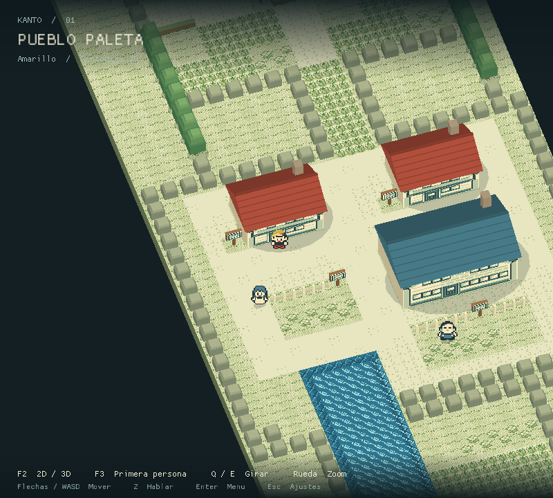
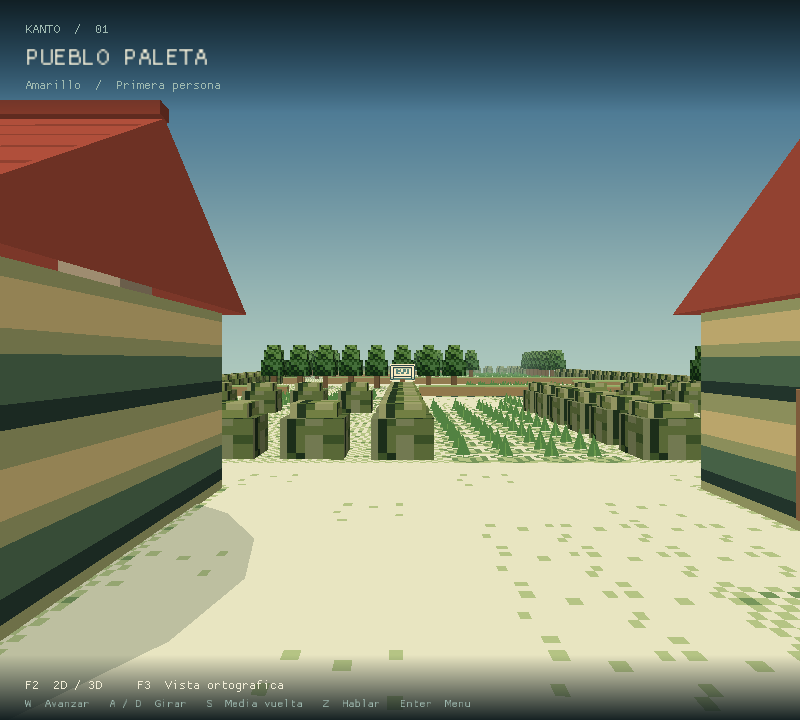
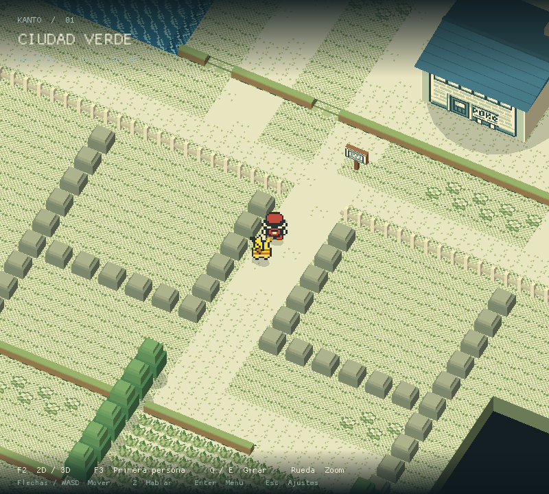
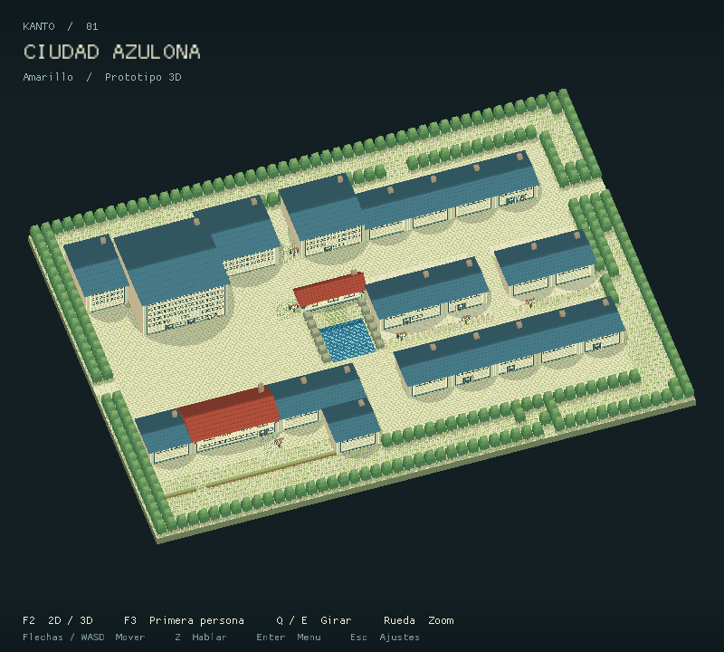
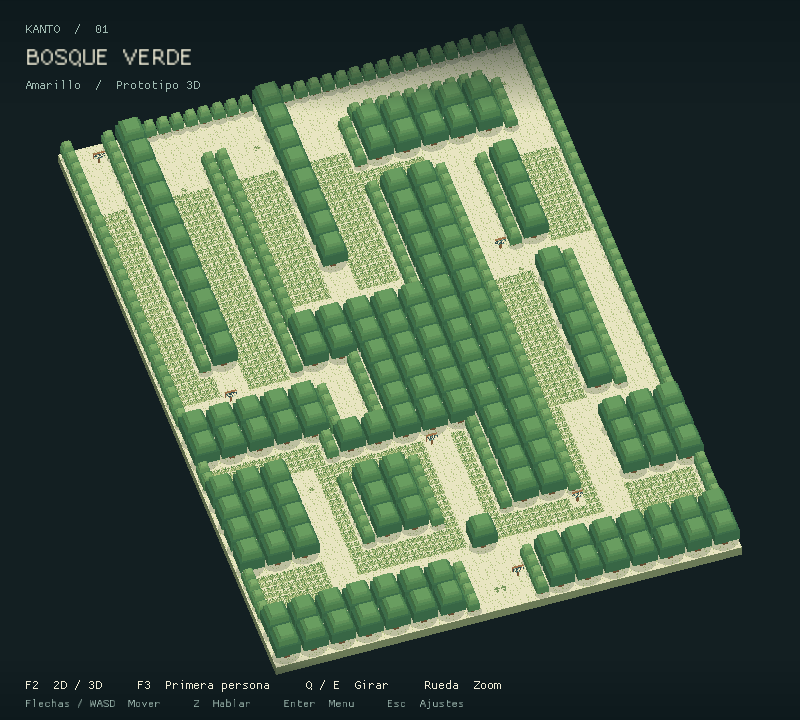
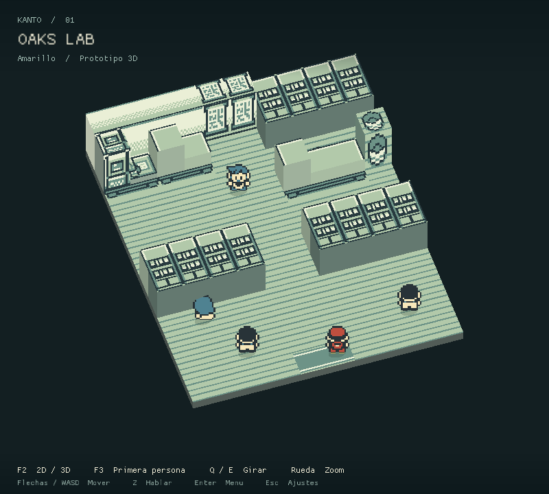
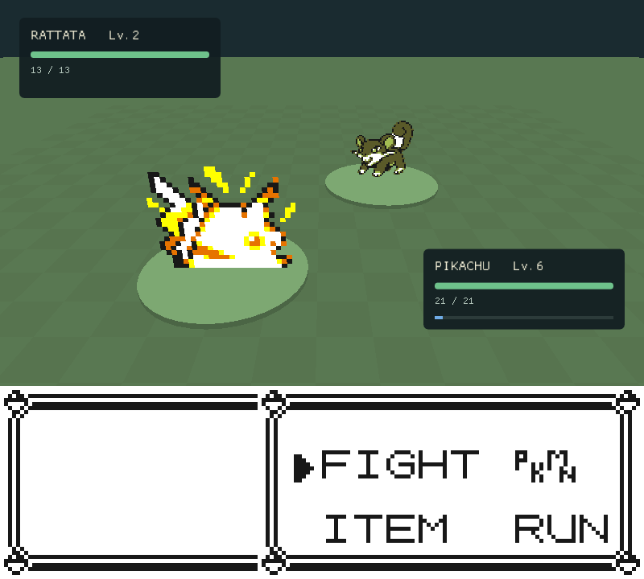

<div align="center">

# Pokémon Yellow 3D

**Explore Kanto from a new perspective.**

A 3D presentation layer for statically recompiled Pokémon Yellow, with an overhead camera, first-person exploration, and the original game logic.

[](https://github.com/dobbygl/pokeyellow3d/actions/workflows/ci.yml)
[](https://github.com/dobbygl/pokeyellow3d/actions/workflows/release.yml)

[Get started](#get-started) · [Screenshots](#screenshots) · [Controls](#controls) · [Development status](#development-status) · [Documentation](#documentation) · [Contributing](#contributing)



**38 outdoor maps · 179 reachable interiors · Two camera modes**

</div>

`pokeyellow3d` is a fork of [GB-Recomp/pokeyellow](https://github.com/GB-Recomp/pokeyellow), powered by [gb-recompiled](https://github.com/GB-Recomp/gb-recompiled). It builds Pokémon Yellow into a native executable and adds a 3D view of the world. Movement, collisions, encounters, story events, battles, and saving remain under the original game's control.

> [!NOTE]
> This is a playable prototype under active development. Outdoor exploration, interiors, and battle presentation have automated coverage, including the completed B1/B2 battle milestones. Validation covers representative scenarios, not a complete story playthrough. See [development status](#development-status) for the current scope.

## Highlights

- **A connected Kanto.** Explore 36 connected outdoor maps, plus Viridian Forest and Vermilion Dock, with terrain, buildings, and textures derived from the ROM.
- **Two perspectives.** Switch between an adjustable overhead camera and first person. Original tile-based movement and four-way interaction are preserved.
- **Interiors on demand.** Enter houses, shops, Pokémon Centers, laboratories, and caves. The renderer generates all 179 reachable interiors as needed.
- **Battles in 3D.** Normal battles combine original Pokémon portraits with animated health displays, trainer introductions, four effect categories, and Poké Ball throws and shakes. Complex moves preserve the original animation; menus and text remain faithful to the game.
- **Original interfaces over a 3D world.** Dialogues and recognized windows retain the scene behind them; full-screen menus frame the original LCD over a dimmed, blurred background. Press `F2` for original 2D presentation.
- **Pokédex and storage.** Browse the original list and data on a 3D device, see encounter areas over Kanto, and use Bill’s twelve boxes with original Pokémon portraits and menus.
- **Bounded rendering work.** Exploration meshes are cached for the current map and its immediate neighbors, with at most five resident maps.

## Screenshots

Real captures from the renderer and its QA runs, stored at their original 800 × 720 resolution. Click any image to inspect it. Celadon City and Viridian Forest use the map-catalog preview camera.

| First-person exploration | Viridian City |
| --- | --- |
| [](docs/screenshots/first-person.png) | [](docs/screenshots/viridian-city.png) |
| **Celadon City** | **Viridian Forest** |
| [](docs/screenshots/celadon-city.png) | [](docs/screenshots/viridian-forest.png) |
| **Professor Oak's laboratory** | **Battle presentation** |
| [](docs/screenshots/oaks-lab.png) | [](docs/screenshots/battle.png) |

## Get started

### Requirements

The current build and graphics checks have been run on Linux with Mesa. Other platforms have not been validated for this fork.

- Git and CMake **3.16 or newer**.
- A compiler with **C11 and C++17** support, plus Make or Ninja.
- **SDL2**, **libcurl**, and **OpenGL ES 2** development libraries and a compatible graphics driver.
- A matching **English USA/Europe Pokémon Yellow ROM**, supplied by you.

CMake downloads the pinned `gb-recompiled` runtime automatically, so the first configure requires network access. Generated C sources are included; RGBDS and the Pokémon disassembly are only needed if you regenerate them.

> [!IMPORTANT]
> No ROM or extracted game assets are included. This build targets the 1 MiB English USA/Europe ROM with SHA-1 `cc7d03262ebfaf2f06772c1a480c7d9d5f4a38e1`. Other revisions and ROM hacks are not supported.

### Build and launch

```sh
git clone https://github.com/dobbygl/pokeyellow3d.git
cd pokeyellow3d

# Supply your matching ROM before configuring to enable all ROM-based tests.
mkdir -p build/roms
cp /path/to/pokeyellow.gb build/roms/pokeyellow.gbc

cmake -S . -B build -DPOKEYELLOW_3D=ON
cmake --build build --parallel 4
ctest --test-dir build --output-on-failure

cd build
./pokeyellow3d
```

On first launch, the runtime extracts the required assets into `assets/pokeyellow/` inside the build directory. Later launches reuse those assets. The launcher starts Pokémon Yellow automatically when its ROM or extracted assets are available.

Run the executable from `build/` so its relative paths resolve correctly. Battery saves are written to `build/pokeyellow.sav`; `Esc` opens runtime settings, including save states and **Restart Game**. Close other instances before using the same save.

<details>
<summary><strong>Build the original 2D executable</strong></summary>

From the repository root:

```sh
cmake -S . -B build/2d -DPOKEYELLOW_3D=OFF
cmake --build build/2d --parallel 4
mkdir -p build/2d/roms
cp /path/to/pokeyellow.gb build/2d/roms/pokeyellow.gbc
cd build/2d
./pokeyellow
```

This produces the original `pokeyellow` executable in a separate build directory, with its own assets and saves.

</details>

## Controls

| Input | Action |
| --- | --- |
| `F2` | Switch between original 2D and 3D presentation |
| `F3` | Switch between overhead and first-person cameras |
| Arrow keys | Original movement along the map axes |
| `W` / `A` / `S` / `D`, overhead | Original up / left / down / right movement |
| `W`, first person | Move forward |
| `A` / `D`, first person | Turn left / right by 90° |
| `S`, first person | Turn around |
| `Q` / `E`, overhead | Rotate the camera within its allowed arc |
| Mouse wheel / `R`, overhead | Zoom / reset camera |
| `Z` or `J` | A: talk, interact, confirm |
| `X` or `K` | B: cancel, go back |
| `Enter` | Original game menu |
| `Esc` | Application settings |

First person follows the original movement grid; it does not provide free movement or mouse look. Dialogues and menus retain the original game controls. Small interiors use a fixed overhead framing; larger rooms allow limited rotation and zoom.

## Development status

| Area | Current scope |
| --- | --- |
| Outdoor world | 36 connected maps, Viridian Forest, and Vermilion Dock; geometry audits and representative journeys are implemented. |
| First person | Movement, turning, transitions, dialogue overlays, and camera parity have dedicated checks. |
| Interiors | All 179 reachable interiors load; representative house, lab, healing, shopping, stair, elevator, and cave journeys are covered. |
| Battles | B1/B2 validated: arenas, portraits, HUDs, party changes, trainer battles, captures, four effect categories, and original-animation fallback. All 165 move records are audited; playable tests exercise representative moves. |
| Menus and transitions | A1/A2/A3 and C1/C2 validated: shared LCD composition, retained 3D menu backgrounds, palette-driven map fades, battle transitions, and save-state transitions. Title-screen and special travel transitions remain pending. |
| Pokédex and PC | 3D list/data device, ROM-verified portraits, AREA overview and Bill’s twelve-box storage are implemented. Item counters, Oak’s monitor evaluation and Hall of Fame presentation remain pending. |

The renderer interprets building heights and furniture visually. Unclassified interior artwork retains its original flat texture, water and vegetation are static, and neighboring-map NPCs are not simulated. Link, tutorial, Safari, and unrecognized battle states retain the original 2D presentation. A complete story playthrough has not been validated.

## Development and validation

The 3D layer reads the game state to draw the scene; it does not run a second gameplay simulation. The SDL integration registers the versioned runtime presentation API through [`src/pallet_presentation.cpp`](src/pallet_presentation.cpp). [`cmake/Pallet3D.cmake`](cmake/Pallet3D.cmake) checks API compatibility and adds the renderer without rewriting runtime sources or generated game C. The default runtime is the `presentation-api-v1` tag of `dobbygl/gb-recompiled`; `GBRT_URL` and `GBRT_REF` are configurable.

| Location | Purpose |
| --- | --- |
| [`src/pallet3d.cpp`](src/pallet3d.cpp) | Rendering, mesh cache, scene selection, and input integration |
| [`src/kanto_rom.h`](src/kanto_rom.h) | ROM map data, connections, tilesets, warps, and objects |
| [`src/world_scene.h`](src/world_scene.h) / [`src/interior_scene.h`](src/interior_scene.h) | Outdoor geometry and interior classification |
| [`src/firstperson.h`](src/firstperson.h) | Camera math and relative controls |
| [`src/battle_state.h`](src/battle_state.h) / [`src/battle3d.h`](src/battle3d.h) | Battle state, portraits, arena, and effects |
| [`src/lcd_overlay.h`](src/lcd_overlay.h) / [`src/menu_layout.h`](src/menu_layout.h) | Cached LCD uploads and original window layout classification |
| [`src/menu_state.h`](src/menu_state.h) / [`src/scene_filter.h`](src/scene_filter.h) | Menu lifetime detection and retained background blur |
| [`src/fade_state.h`](src/fade_state.h) | Palette tones and ROM-validated map transition detection |
| [`tests/`](tests/) | State tests, map audits, rendering checks, and scripted journeys |
| `pokeyellow_*.c` | Pre-generated game sources |

### Tests

CMake always registers eight ROM-independent checks: first-person controls, menu layouts, presentation blending, and five synthetic-ROM tests, including a headless rendering check and procedural portrait decompression. With the ROM in `build/roms/pokeyellow.gbc` **at configure time**, sixteen additional tests cover game data and presentation, for 24 in total. Original-engine portrait, nest and SRAM comparisons require private QA evidence and explicitly skip when it is absent. Reconfigure after adding the ROM. Use `ctest --test-dir build -LE rom --output-on-failure` to run the ROM-independent set.

```sh
cmake -S . -B build -DPOKEYELLOW_3D=ON
cmake --build build --parallel 4
ctest --test-dir build --output-on-failure

# Optional helper for scripted rendering and gameplay checks.
cmake --build build --target pallet_render_smoke --parallel 4
```

The full QA scripts require local ROM and save-state fixtures. They check representative journeys, scene transitions, OpenGL errors, cache limits, and whether drawing leaves game memory unchanged. Fixture setup, commands, and recorded results are documented in [PALLET3D.md](PALLET3D.md#compilar-y-probar). These checks do not imply complete game coverage.

<details>
<summary><strong>Regenerate the game C sources</strong></summary>

Only needed when changing the recompilation. Requires local clones of `pret/pokeyellow` and `gb-recompiled`, plus RGBDS and Make.

```sh
tools/regen.sh /path/to/pret/pokeyellow /path/to/gb-recompiled
cmake -S . -B build
cmake --build build --parallel 4
ctest --test-dir build --output-on-failure
```

The script rebuilds the ROM and recompiler, then replaces the generated sources and asset manifest. Review the diff and verify compatibility with the pinned runtime before committing.

</details>

<details>
<summary><strong>Use the cartridge in a multi-game launcher</strong></summary>

```cmake
include(FetchContent)
FetchContent_Declare(pokeyellow
    GIT_REPOSITORY https://github.com/dobbygl/pokeyellow3d.git
    GIT_TAG main
)
FetchContent_MakeAvailable(pokeyellow)
```

Link `pokeyellow_cart` into your launcher and register `pokeyellow_main(argc, argv)`. The standalone executable and 3D SDL hooks are enabled only when this repository is the top-level CMake project; consuming the cartridge alone does not enable the 3D frontend.

</details>

### Troubleshooting

| Symptom | What to check |
| --- | --- |
| ROM is missing or the launcher stays open | Start from `build/` and check `roms/pokeyellow.gbc`. |
| ROM hash mismatch | Verify the revision against the SHA-1 above; renaming a different ROM does not make it compatible. |
| CMake cannot find SDL2, CURL, or GLES | Install the corresponding development packages, then reconfigure. |
| `Pallet 3D: runtime integration point changed` | Use the pinned `GBRT_REF` below; a cached override may select an incompatible runtime. |
| A menu or scene appears in 2D | Original interfaces and unsupported states intentionally use the 2D framebuffer. Press `F2` to check your presentation preference. |
| CTest omits the cartridge-backed tests | Add the matching ROM to `build/roms/`, then rerun CMake configuration. |

The current runtime pin is `6581880fce60e6f139901a5942fc984e9c1db8ab`. Restore it with:

```sh
cmake -S . -B build -DGBRT_REF=6581880fce60e6f139901a5942fc984e9c1db8ab
```

## Documentation

The detailed engineering notes and plans are written in English; `PALLET3D.md`, `PLAN_KANTO_3D.md`, and `PLAN_MENUS_TITULO_TRANSICIONES.md` are still being translated from Spanish.

- [Technical guide, QA procedures, and measured performance](PALLET3D.md)
- [Kanto world plan and implementation evidence](PLAN_KANTO_3D.md)
- [First-person camera and controls](PLAN_PRIMERA_PERSONA.md)
- [Interiors and battle presentation](PLAN_INTERIORES_COMBATES.md)
- [Menus, title screen, and transitions](PLAN_MENUS_TITULO_TRANSICIONES.md)
- [Pokédex and PC presentation](PLAN_POKEDEX_PC.md)

## Acknowledgments

Built on [GB-Recomp/pokeyellow](https://github.com/GB-Recomp/pokeyellow) and the [gb-recompiled runtime and recompiler](https://github.com/GB-Recomp/gb-recompiled), with the [pret/pokeyellow disassembly](https://github.com/pret/pokeyellow) as a reference for the original game's data and behavior. Rendering and runtime UI use SDL2, OpenGL ES 2, and Dear ImGui.

## Contributing

[`.github/workflows/ci.yml`](.github/workflows/ci.yml) builds Linux (GCC and Clang) on every push to `main` and every pull request, plus a Linux build with the 3D layer disabled. The Windows (MSVC) and macOS jobs are defined but disabled for now: the pinned gb-recompiled runtime is not portable to MSVC yet, and macOS lacks the GLES2 headers. Match that locally before opening a pull request:

```sh
cmake -S . -B build -DPOKEYELLOW_3D=ON -DCMAKE_BUILD_TYPE=MinSizeRel
cmake --build build --parallel 4

# Same selection the CI runs: everything that doesn't need the real ROM.
ctest --test-dir build -LE rom --output-on-failure
```

> [!NOTE]
> Tests tagged `rom` register only when `build/roms/pokeyellow.gbc` and, for some journeys, private save states are present at configure time; without them they are simply never registered, not failed. `-LE rom` additionally excludes them when a ROM is present, so a local run with the ROM stays comparable to CI. The ROM and any save state are never part of this repository or of the CI environment.

Tagging a commit `vX.Y.Z` triggers [`.github/workflows/release.yml`](.github/workflows/release.yml), which builds Linux and publishes `pokeyellow3d` packages (with `PALLET3D.md`, `README.md`, and a `RUN.md`) to the GitHub release. It never bundles a ROM either.
